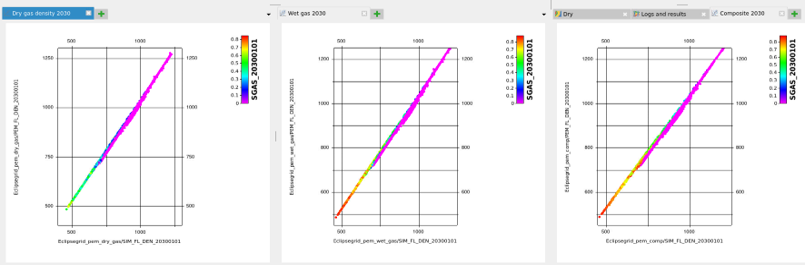

# Save results

## Main results - saturated properties

The default is to save results to disk, mostly in `.roff` format. The main results from `fmu-pem` are also saved in `.grdecl` format, as this is required by `seismic_forward`, where they are used. [Table 1](#table-1-saturated-properties) lists the different grids that are saved.

| Grid | Type | Example name | Comment |
| ------------------------ | ---------------------- | ---------------------- | -------- |
| Density | Saturated rock properties | simgrid--density--20180101.roff | One for each simulator date |
| Vp | Saturated rock properties | simgrid--vp--20180101.roff | One for each simulator date |
| Vs | Saturated rock properties | simgrid--vs--20180101.roff | One for each simulator date |
| Vp/Vs | Saturated rock properties | simgrid--vpvs--20180101.roff | One for each simulator date |
| AI | Saturated rock properties | simgrid--ai--20180101.roff | One for each simulator date |
| SI | Saturated rock properties | simgrid--si--20180101.roff | One for each simulator date |
| Vp, Vs and Density | Saturated rock properties | pem--20180101.grdecl | One for each simulator date, three properties within one file |

<span id="table-1-saturated-properties"><strong>Table 1:</strong> List of properties that are saved if `save_results_to_disk` is set. Note that the `.grdecl` files are always saved, regardless of the `save_results_to_disk` option</span>

## Intermediate properties

For QC purposes, intermediate results can also be saved. [Table 2](#table-2-intermediate-results) lists the different properties that are included in the intermediate properties, which are effective properties for minerals and fluids, dry rock properties, grid showing cells that are below bubble point and modified porosity grid, can also be saved.

| Grid | Type | Example name | Comment |
| ------------------------ | ---------------------- | ---------------------- | -------- |
| Fluid density | Effective fluid properties | simgrid--density_fluid--20180101.roff | One for each simulator date |
| Fluid bulk modulus | Effective fluid properties | simgrid--bulk_modulus_fluid--20180101.roff | One for each simulator date |
| Mineral density | Effective mineral properties | simgrid--density_mineral.roff | Static value |
| Mineral bulk modulus | Effective mineral properties | simgrid--bulk_modulus_mineral.roff | Static value |
| Mineral shear modulus | Effective mineral properties | simgrid--shear_modulus_mineral.roff | Static value |
| Pore pressure | Pressure properties | simgrid--pressure--20180101.roff | From the reservoir simulator, one for each date |
| Overburden pressure | Pressure properties | simgrid--overburden_pressure--20180101.roff | One for each date |
| Effective pressure | Pressure properties | simgrid--effective_pressure--20180101.roff | One for each date |
| Dry rock density | Dry rock properties | simgrid--density_dry_rock--20180101.roff | One for each simulator date |
| Dry rock bulk modulus | Dry rock properties | simgrid--bulk_modulus_dry_rock--20180101.roff | One for each simulator date |
| Dry rock shear modulus | Dry rock properties | simgrid--shear_modulus_dry_rock--20180101.roff | One for each simulator date |
| Below bubble point | Binary indicator | simgrid--below_bubble_point--20180101.roff | Grid indicating cells where the formation pressure is below the bubble point |
| Modified porosity | Porosity | simgrid--adjusted_porosity.roff | When net porosity is adjusted by non-net fraction |

<span id="table-2-intermediate-results"><strong>Table 2:</strong> List of properties that are saved if `save_intermediate_results` is set.</span>

## Difference properties

Difference properties calculated between different simulation dates can be made for saturated rock properties and for convenience, also for input properties from the reservoir simulator. This is controlled by the `differences` settings in the parameter YAML file:

```yaml
# For 4D parameters: settings for which difference parameters to calculate
diff_calculation:
  DENS: [ diffpercent ]
  VP: [ diffpercent ]
  VS: [ diffpercent ]
  SI: [diff, diffpercent, ratio]
  TWTPP: [diff]
  PRESSURE: [diff]
```

Three different difference attributes can be calculated: difference, difference percent and ratio. In [Table 3](#table-3-difference-properties), example files of difference properties are shown.

| Grid | Type | Example name | Comment |
| ------------------------ | ---------------------- | ---------------------- | -------- |
| SI ratio | Saturated rock properties | simgrid--siratio--20180701_20180101.roff | One for each difference date |
| Vp diffpercent | Saturated rock properties | simgrid--vpdiffpercent--20180701_20180101.roff | One for each difference date |
| TWT PP difference | Two-way travel time | simgrid--twtppdiff--20180701_20180101.roff | One for each difference date |

<span id="table-3-difference-properties"><strong>Table 3:</strong> List of some of the properties that can be saved if `save_results_to_disk` and `diff_calculation` options are set.</span>

## Output directories

All `.roff` files are saved to `share/results/grids`. The `.grdecl` files are saved to `sim2seis/output/pem`. The prefix in the `.roff` file names is taken from the `SIMGRIDNAME` in the global configuration file.

```yaml
# Settings for saving results
results:
  save_results_to_disk: True
  save_intermediate_results: True
```

## Example: comparison of fluid properties

An example on QC of fluid properties is comparison between effective fluid density as estimated from `fmu-pem` and from the reservoir simulator. The estimates should be close, as shown in [Figure 1](#figure-1-fluid-density).



<span id="figure-1-fluid-density"><strong>Figure 1:</strong> Estimate of fluid density from simulator model (x-axis) and PEM (y-axis) for a selected time step. With settings for either dry gas, wet gas or a compositional model, simulator model and PEM are in agreement.</span>
<br><br>
